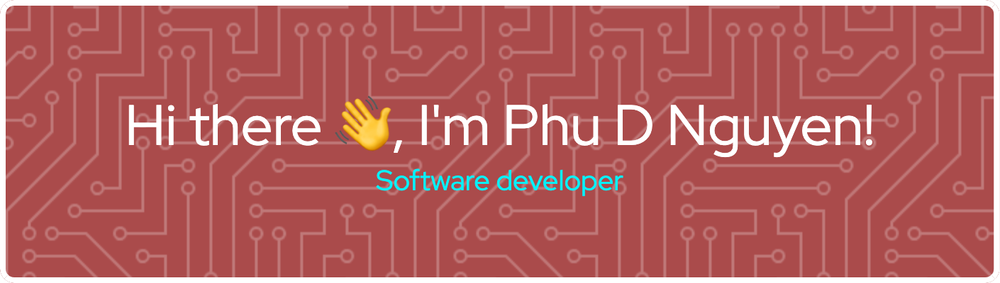

I'm a forward-thinking computer science student at Virginia Tech, driven by a passion for programming, big data, and machine learning. My academic pursuits blend seamlessly with my professional endeavors, where I currently tackle challenges in an SMS anti-spam project and explore a multitude of technologies.

## 🛠️ Current Work
### Role: Software Developer at [ISTT](https://www.istt.com.vn/en/home/)
In my role as a Software Developer, I dive into diverse and complex projects:
- **Text Preprocessing and Filtering**: Crafting intelligent algorithms for text processing and spam filtering.
- **Data Visualization**: My visualization of our team progress. The graph represent the classification and content of our SMS test dataset [interactive visualizations using Python Plotly](link-to-your-plotly-visualization).
- **Data Crawling**: Unleashing web scraping to gather valuable data and insights.
- **Technologies**: Python, Big Data Tools (Airflow, Spark), Scrum Management (Jira), Plotly, MySQL, Apache Superset.

I thrive on collaboration, innovation, and excellence, striving to make a meaningful impact on my team's goals.

## 🎓 Academic Journey
Studying computer science at **Virginia Tech**, I'm immersed in the fascinating world of technology. My academic interests are fueled by a desire to explore NLP models, classification algorithms, and the ever-evolving field of machine learning.

## 🚀 Personal Project: UrFlight
My latest adventure, **UrFlight**, a personal project driven by curiosity:
- **Goal**: Navigating new tools, expanding knowledge, and hunting for reasonable flight prices.
- **Status**: In-flight, with regular updates amidst professional commitments.
- **Technologies**: Python, S3 AWS, PySpark, Airflow, PostgreSQL, Elasticsearch, Grafana, Prometheus, Django.
- **Repository**: [eCommData-Processing on GitHub](https://github.com/DucPhuNguyen0412/eCommData-Processing)

## 📬 Connect with Me
I'm always open to collaboration, discussions, or just a friendly chat:
- **Email**: [nphu01@vt.edu](mailto:nphu01@vt.edu)
- **Phone**: 540-988-6514

## 🙋 Pronouns
He/him
